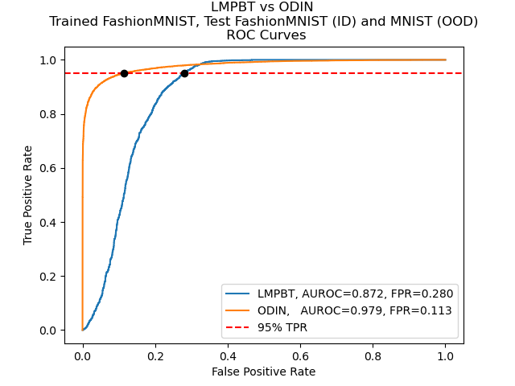
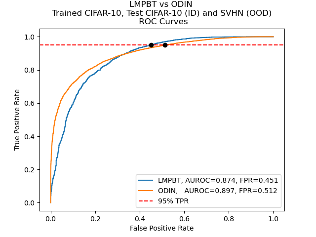
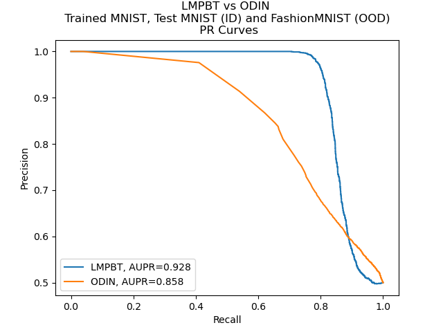
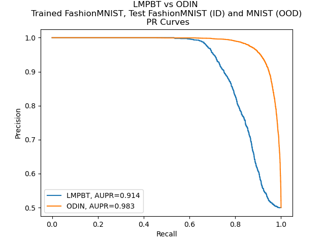
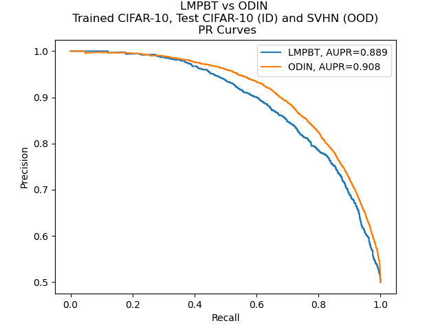
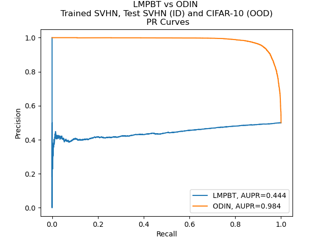

# BDL-OOD

For our Bayesian Deel Learning course at Tufts University, we conducted bidirectional out of distribution (OOD) detection experiments comparing the performance of a Basyesian (LMPBT VAE) and non-Bayesian (ODIN CNN). We found that both methods had varying performance depending on the in vs out of distribution datasets and directionality.

TODO full report

## Results

### Receiver Operating Characteristic Curves
<table>
  <tbody>
    <tr>
      <td></td>
      <td></td>
    </tr>
    <tr>
      <td></td>
      <td></td>
    </tr>
  </tbody>
</table>


### Precision Recall Curves
<table>
  <tbody>
    <tr>
      <td></td>
      <td></td>
    </tr>
    <tr>
      <td></td>
      <td></td>
    </tr>
  </tbody>
</table>

## Code

### `src/densenet.pytorch_fork`

We "forked" a Densenet PyTorch implementation from https://github.com/bamos/densenet.pytorch to train models using the ODIN method on Kaggle.

### `src/LMPBT`

We "forked" the LMPBT implementation https://github.com/keunseokim91/LMPBT from the paper authors to train and evaluate LMPBT models on Kaggle.

### `src/ODIN`

We "forked" the ODIN implementation https://github.com/facebookresearch/odin from the paper authros to evaluate ODIN models on Kaggle.


## Conda environment

### Create from yml
```
conda env create -f environment.yml
```

### Activate environment
```
conda activate bdl_ood
```


## Notes

### Loading PyTorch Models
Loading a PyTorch model requires the model class code to be present in the same directory, ie the correct respective `densenet.py`. If you use the wrong `densenet.py` file, you'll likely run into errors due to slight implementation differences.

There are also 2 ways of saving and loading the models

### Directly saving and loading the model
```py
torch.save(model, os.path.join(args.save, 'my_model.pth')) # save the model
model = torch.load(os.path.join(args.save, 'my_model.pth'), map_location=torch.device('cpu')) # load the model
```
### Saving and loading the model parameters
```py
torch.save(model.state_dict(), 'my_model.pth') # save the model state

# create a new model and load the state
model = DenseNet121(num_classes=10, grayscale=True)
model.load_state_dict(torch.load("my_model.pth"))
```

### RuntimeError: Given input size: (512x1x1). Calculated output size: (512x0x0). Output size is too small
This flavor of error appears usually when you downsample the image too much via convolution. In my (Harry's) experience, it's because the model expected a 32x32 image but you passed it a 28x28.

## Data

### MNIST

Run

`wget https://data.deepai.org/mnist.zip` 

### FashionMNIST

Data can be downloaded from here: https://www.kaggle.com/datasets/zalando-research/fashionmnist?select=t10k-images-idx3-ubyte

### CIFAR-10

Data can be downloaded from here: https://www.cs.toronto.edu/~kriz/cifar-10-python.tar.gz

### SVHN

Data can be downloaded from here: https://www.kaggle.com/datasets/stanfordu/street-view-house-numbers

